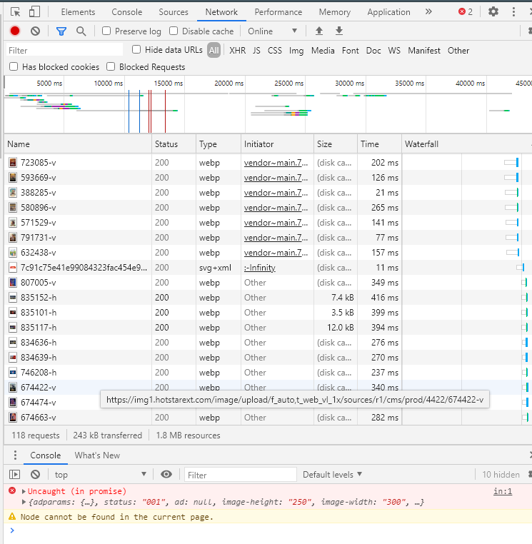
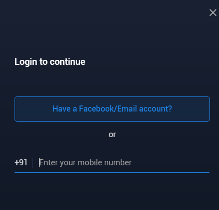
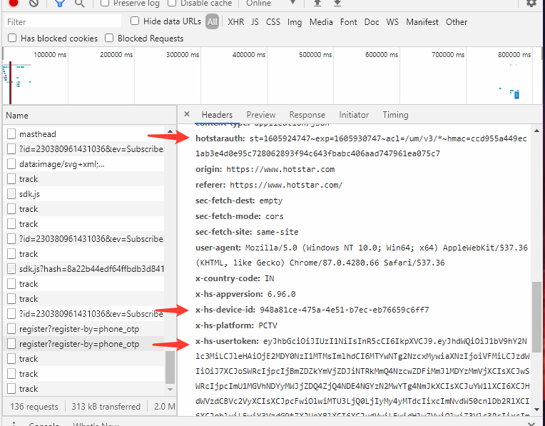

# Brute Force Hack tool for Hotstar

Crack into anyones account using OTP login of Hotstar. (OBSOLETE)

NOTE : This is for educational purpose and this hack-tool will NOT WORK currently.
You can use this as a model for your works.
The vulnerability was

### Principle
Its works on a known vulnerability of Hotstar which was later resolved.
Hotstar uses a 4 digit OTP login which can easily brute-forced.
The same has been described clearly in this [linkedin post.](https://www.linkedin.com/pulse/how-i-hacked-hotstar-15-minutes-why-4-digit-otps-should-chhabra)

### How-to
* Use the Developer tools in Google chrome after visiting [hotstar.com](http://hotstar.com/)
* Take the network tab.  

* Use a email or phone number (use your own or use the one you want to hack) and continue. 

* Make sure that the account has OTP login enabled or this won't work. 😄
* And when it ask to enter an OTP you can go realy crazy here and enter any OTP of your choice.
* Now we are getting to the point, you may see that your OTP gets rejected (if you are lucky enough). And you'll also notice that new requests are made in the network tab.
* Select *register?register-by=phone_otp* (choose the second as in the image) and grab the following field values to use in the code :
  * hotstarauth
  * x-hs-device-id
  * x-hs-usertoken 
  
 

 
 * Paste the field in the code and thats it.
 
 ### Conclution
 I know this is a bit complicated, and doing all these for something which won't work now is worthless. But I belive that this repo can help other for doing fun stuffs with other sites which may have the same vulnerability. I'm commiting this repo in the belief that the vulnerability in hotstar was fixed already.
**Do it at your own Risk.**

### References
https://www.linkedin.com/pulse/how-i-hacked-hotstar-15-minutes-why-4-digit-otps-should-chhabra

 
